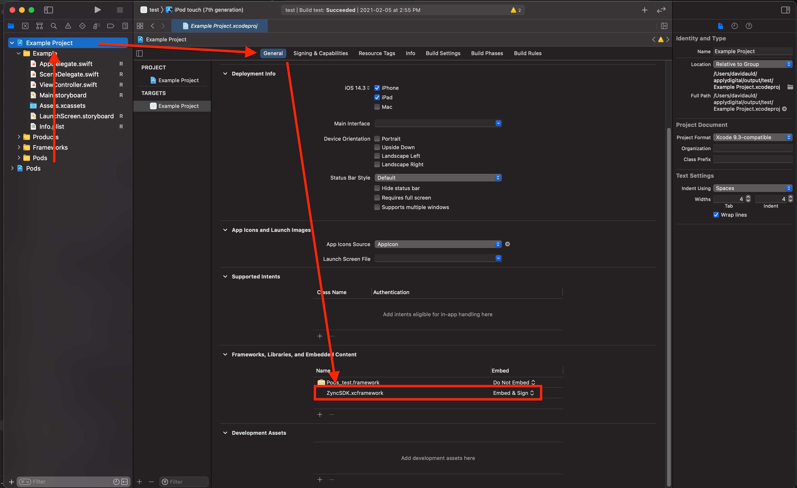

# Zync iOS SDK
www.zync.com

Video Playback SDK for no DRM and FairPlay content. Note that FairPlay content can only be played on a real device.

Feel free to have a look at the `Zync Example` project to see an example on how you can implement Zync into your project.

## Requirements

- Xcode 12.0+
- iOS 14.0+

## **Step 1:** Install ZyncSDK

1. Drag-and-drop the ZyncSDK.xcframework folder into your project.
1. Change `Libraries and Embedded content` at `ZyncSDK.xcframework` in Xcode `General` tab -> `Frameworks` -> `Libraries and Embedded content` change it to `Embed & Sign`.



The ZyncSDK relies on the following dependencies which must be added and embedded into your app. The dependencies can be added through a cocaopod install:

```
pod 'SDWebImage'
pod 'lottie-ios'
```

## **Step 2:** Initializing the Zync SDK

A valid `Zync API key` is required to use the SDK. Obtain an API key from your Zync contact and pass this value into the Zync SDK initalization. `eg. let zyncSDK = Zync(apikey: "<api-key>")`.

## **Step 3:** Using the Zync SDK Player

```swift
import UIKit
import ZyncSDK

class ViewController: UIViewController {

    let zyncSDK = Zync(apiKey: "<api-key>")

    override func viewDidLoad() {
        super.viewDidLoad()
    }

    override func viewDidAppear(_ animated: Bool) {
        let browseVC = zyncSDK.launchBrowse()
        self.navigationController?.present(browseVC, animated: false, completion: nil)
    }

    func playDrm() {
        let streamUrl = URL(string: "https://example-stream.com/drm-fairplay/sampleVideo/master.m3u8")!
        // The FairPlay player only works with Zync content
        let zyncPlayer = zyncSDK.createPlayer(fairplayUrl: streamUrl)
        show(zyncPlayer, sender: self)
    }

    func playNonDrm() {
        let streamUrl = URL(string: "https://example-stream.com/non-drm/sampleVideo/master.m3u8")!
        let zyncPlayer = zyncSDK.createPlayer(nonDrmUrl: streamUrl)
        show(zyncPlayer, sender: self)
    }
}
```

## **Step 4:** Build and run

Select `_Product` -> `Run_` in the menu bar.

## API

### URL Properties

Stream URL: (ie: "https://xyz.com/drm-fairplay/movie.mp4/master.m3u8")
The URL to the media content playlist. 

#### Optional Properties
License URL: (ie: "https://xyz.com/api/licenses/72828972B-8222-876E-ZH11-LI08922D")
The URL to the Fairplay license server for this content. Also know as the License Acquision URL.

Certificate URL: (ie: "https://xyz.com/fairplay.cer")
The URL to the Fairplay certificate of the license server.

## createZyncPlayer

Creates a Zync player that can play either FairPlay content or non DRM content. If no `license key url` and `FairPlay certificate` is provided, the player defaults to the `Zync FairPlay license and ceritficate`.

### Example - FairPlay

```swift
let zyncPlayer = Zync().createZyncPlayer(fairplayUrl: streamUrl)
show(zyncPlayer, sender: self)
```

### Example - FairPlay with license url and certicate url specified

```swift
let zyncPlayer = Zync().createZyncPlayer(fairplayUrl: streamUrl, licenseUrl: licenseUrl, certificateUrl: certificateUrl)
show(zyncPlayer, sender: self)
```

### Example - Non DRM

```swift
let zyncPlayer = Zync().createZyncPlayer(nonDrmUrl: streamUrl)
show(zyncPlayer, sender: self)
```

## launchBrowse

Launches the Browse Playlist experience

```swift
let browseViewController = Zync().launchBrowse()
self.navigationController?.present(browseVC, animated: false, completion: nil)
```
