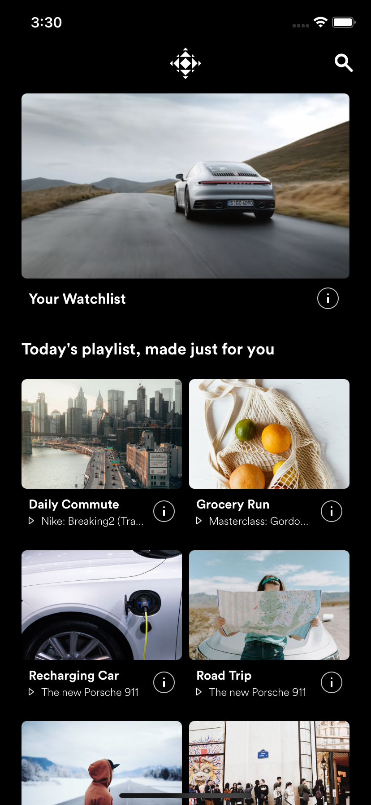
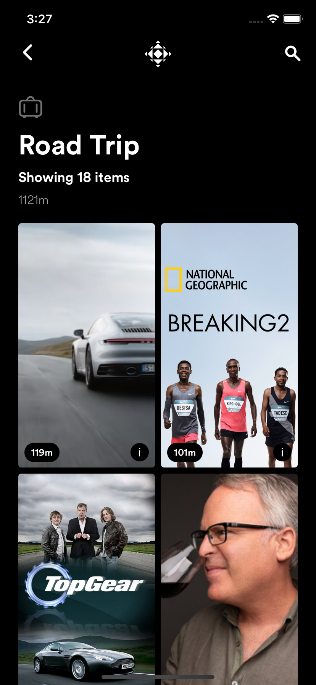
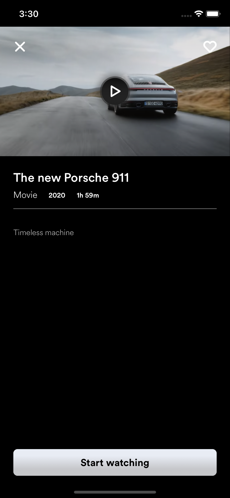
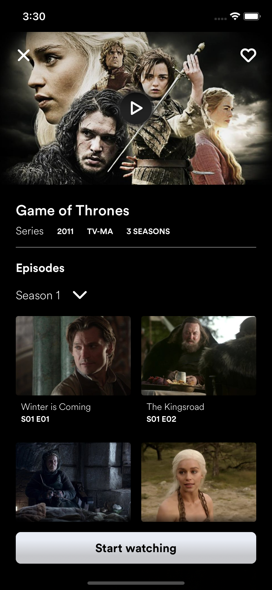
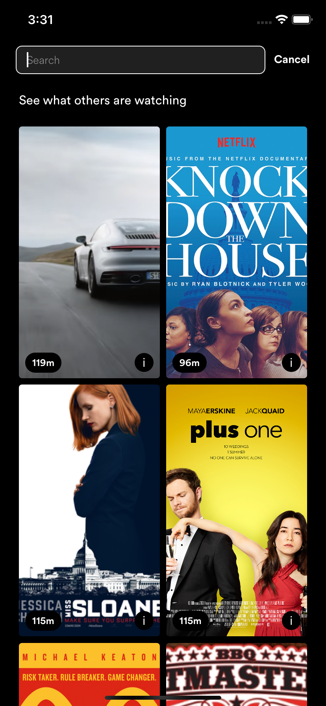
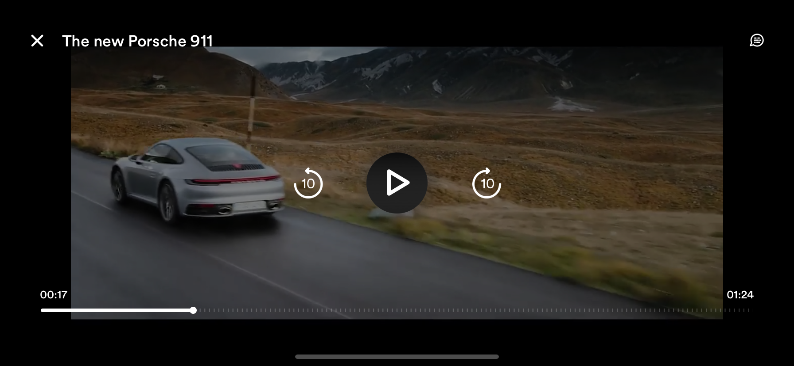

# Zync iOS SDK
www.zync.com

*Looking for? [Android SDK Documentation](README_Android.md)*

Video Playback SDK for no DRM and FairPlay content. Note that FairPlay content can only be played on a real device (not via simulator).

Feel free to have a look at the `Zync Example` project to see an example on how you can implement Zync into your project.

API Documentation can be found here: https://api.zync.com/

## Requirements

- Xcode 12.0+
- iOS 14.0+

## **Step 1:** Install ZyncSDK

### 1. Install dependencies
The ZyncSDK relies on the following dependencies which must be added and embedded into your app. The dependencies can be added through a Cocoapod install.

1. If you don't have Cocoapods setup already, you need to initialize pods with `pod init`.
2. In your Podfile, add the dependencies:
   ```
   pod 'SDWebImage'
   pod 'lottie-ios'
   ```
3. Run `pod install` and open the `.xcworkspace` file that is created in Xcode.

### 2. Install the ZyncSDK framework

1. Copy the `ZyncSDK.xcframework` folder into your project's root folder.
2. Open your project's `.xcworkspace` file in Xcode
3. Right click on the Frameworks folder and select _Add files to "ProjectName"_
4. Check "Copy items if needed" and add the `ZyncSDK.xcframework` folder
5. Add the `ZyncSDK.xcframework` to `Frameworks, Libraries and Embedded content` at in Xcode `General` tab -> `Frameworks` -> `Frameworks, Libraries and Embedded content` and set the `Embed` setting to `Embed & Sign`.


## **Step 2:** Initializing the Zync SDK

A valid `Zync API key` is required to use the SDK. Obtain an API key from your Zync contact and pass this value into the Zync SDK initalization. `eg. let zyncSDK = Zync(apikey: "<api-key>")`.

## **Step 3:** Using the Zync SDK Player

```swift
import UIKit
import ZyncSDK

class ViewController: UIViewController {

    let zyncSDK = Zync(apiKey: "<api-key>")

    override func viewDidLoad() {
        super.viewDidLoad()
    }

    override func viewDidAppear(_ animated: Bool) {
        let browseVC = zyncSDK.launchBrowse()
        self.navigationController?.present(browseVC, animated: false, completion: nil)
    }

    func playDrm() {
        let streamUrl = URL(string: "https://example-stream.com/drm-fairplay/sampleVideo/master.m3u8")!
        // The FairPlay player only works with Zync content
        let zyncPlayer = zyncSDK.createPlayer(fairplayUrl: streamUrl)
        show(zyncPlayer, sender: self)
    }

    func playNonDrm() {
        let streamUrl = URL(string: "https://example-stream.com/non-drm/sampleVideo/master.m3u8")!
        let zyncPlayer = zyncSDK.createPlayer(nonDrmUrl: streamUrl)
        show(zyncPlayer, sender: self)
    }
}
```

## **Step 4:** Build and run

Select `Product` -> `Run` in the menu bar.

## API

### URL Properties

Stream URL: (ie: "https://xyz.com/drm-fairplay/movie.mp4/master.m3u8")
The URL to the media content playlist. 

#### Optional Properties
License URL: (ie: "https://xyz.com/api/licenses/72828972B-8222-876E-ZH11-LI08922D")
The URL to the Fairplay license server for this content. Also know as the License Acquision URL.

Certificate URL: (ie: "https://xyz.com/fairplay.cer")
The URL to the Fairplay certificate of the license server.

## createZyncPlayer

Creates a Zync player that can play either FairPlay content or non DRM content. If no `license key url` and `FairPlay certificate` is provided, the player defaults to the `Zync FairPlay license and ceritficate`. The Zync player supports multiple audio tracks and subtitles.

### Example - FairPlay

```swift
let zyncPlayer = Zync().createZyncPlayer(fairplayUrl: streamUrl)
show(zyncPlayer, sender: self)
```

### Example - FairPlay with license url and certicate url specified

```swift
let zyncPlayer = Zync().createZyncPlayer(fairplayUrl: streamUrl, licenseUrl: licenseUrl, certificateUrl: certificateUrl)
show(zyncPlayer, sender: self)
```

### Example - Non DRM

```swift
let zyncPlayer = Zync().createZyncPlayer(nonDrmUrl: streamUrl)
show(zyncPlayer, sender: self)
```

## launchBrowse

Launches the Browse Playlist experience.
The landing page has the following functionality: Global search and playlists.
From the landing page you can tap to play a video or access the playlist details.
The playlist details include all availble media in the playlist, i.e. movies and TV series. From the playlist, you can play the media or view the media details. On the TV series detail page, you can view seasons and episodes.
Any media can be added to a watchlist from the media detail page. Once a media has been added to the watchlist, the watchlist will show up on the browse landing page.

```swift
let browseViewController = Zync().launchBrowse()
self.navigationController?.present(browseVC, animated: false, completion: nil)
```
Browse Landing Page | Playlist Page | Media Details Page | Series Details Page | Search Page
:-------------------------:|:-------------------------:|:-------------------------:|:-------------------------:|:-------------------------:
 |   |  |  | 

Zync Video Player | 
:-------------------------:|
 |